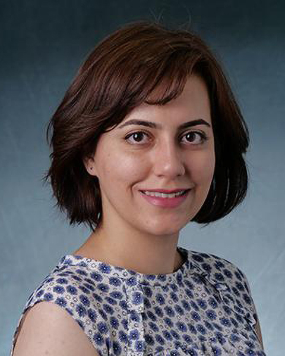
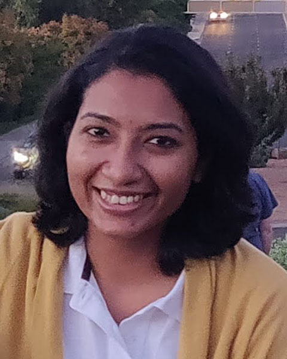
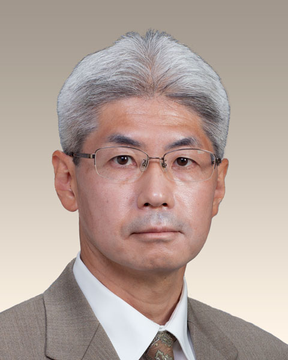

## Organizing Committee

<a href="https://www.colorado.edu/cmci/people/graduate-students/information-science/nasim-sonboli">Nasim Sonboli</a>

University of Colorado Boulder

<a href="https://amifaraj.github.io/">Amifa Raj</a>

Boise State University

<a href="https://www.kamishima.net/">Toshihiro Kamishima</a>

National Institute of Advanced Industrial Science and Technology (AIST)

## Program Committee
{:style="clear: both"}

* Alex	Beutel	(Google)
* Ana-Andreea	Stoica	(Columbia University)
* Aneseh	Alvanpour	(University of Louisville)
* Bart	Knijnenburg	(Clemson University)
* Benjamin	Fields	(BBC News)
* Chirag	Shah	(University of Washington)
* Christo	Wilson	(Northeastern University)
* Daniel	Kluver	(University of Minnesota)
* Dimitris	Paraschakis	(Malmo University)
* Henriette	Cramer	(Spotify)
* Ke	Yang	(New York University)
* Ludovico	Boratto	(University of Cagliari)
* Meike	Zehlike	(Max Planck Institute for Software Systems)
* Mirko	Marras	(École Polytechnique Fédérale de Lausanne ‐ EPFL)
* Piotr	Sapiezynski	(Northeastern University)
* Sirui	Yao	(Google)

